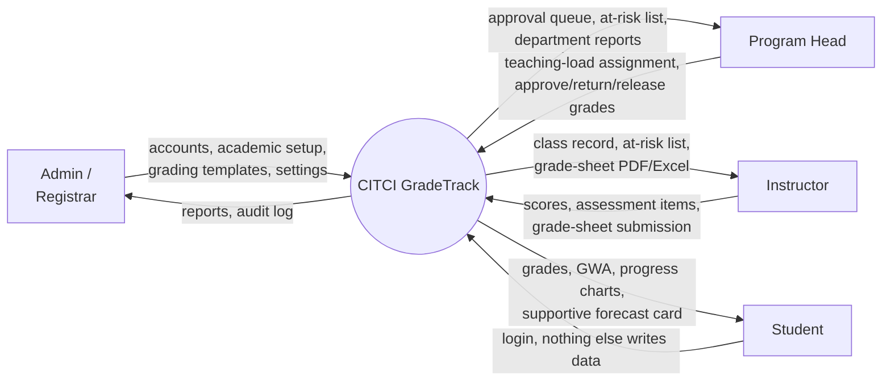
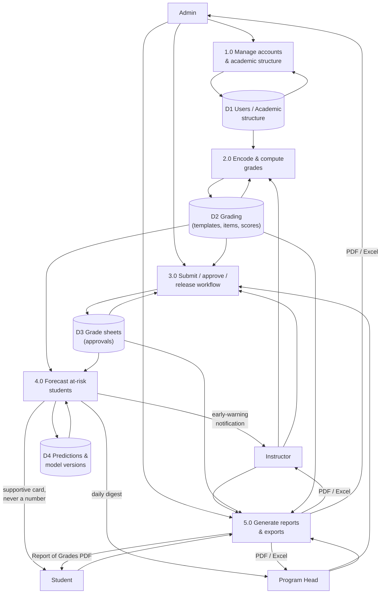

# Data Flow Diagrams

## Context diagram (level 0)

```mermaid
graph LR
    Admin["Admin /<br/>Registrar"]
    ProgramHead["Program Head"]
    Instructor["Instructor"]
    Student["Student"]

    System(("CITCI GradeTrack"))

    Admin -->|accounts, academic setup,<br/>grading templates, settings| System
    System -->|reports, audit log| Admin

    ProgramHead -->|teaching-load assignment,<br/>approve/return/release grades| System
    System -->|approval queue, at-risk list,<br/>department reports| ProgramHead

    Instructor -->|scores, assessment items,<br/>grade-sheet submission| System
    System -->|class record, at-risk list,<br/>grade-sheet PDF/Excel| Instructor

    Student -->|login, nothing else writes data| System
    System -->|grades, GWA, progress charts,<br/>supportive forecast card| Student
```

## Level 1 — inside the system

```mermaid
graph TB
    Admin["Admin"]
    ProgramHead["Program Head"]
    Instructor["Instructor"]
    Student["Student"]

    P1["1.0 Manage accounts<br/>& academic structure"]
    P2["2.0 Encode & compute<br/>grades"]
    P3["3.0 Submit / approve /<br/>release workflow"]
    P4["4.0 Forecast at-risk<br/>students"]
    P5["5.0 Generate reports<br/>& exports"]

    D1[("D1 Users / Academic<br/>structure")]
    D2[("D2 Grading<br/>(templates, items, scores)")]
    D3[("D3 Grade sheets<br/>(approvals)")]
    D4[("D4 Predictions &<br/>model versions")]

    Admin --> P1
    P1 --> D1
    D1 --> P1

    Instructor --> P2
    P2 --> D2
    D2 --> P2
    D1 --> P2

    Instructor --> P3
    ProgramHead --> P3
    Admin --> P3
    P3 --> D3
    D3 --> P3
    D2 --> P3

    D2 --> P4
    D3 --> P4
    P4 --> D4
    D4 --> P4
    P4 -->|early-warning<br/>notification| Instructor
    P4 -->|daily digest| ProgramHead
    P4 -->|supportive card,<br/>never a number| Student

    ProgramHead --> P5
    Admin --> P5
    Instructor --> P5
    Student --> P5
    D3 --> P5
    D2 --> P5
    P5 -->|PDF / Excel| Instructor
    P5 -->|PDF / Excel| ProgramHead
    P5 -->|PDF / Excel| Admin
    P5 -->|Report of Grades PDF| Student
```
